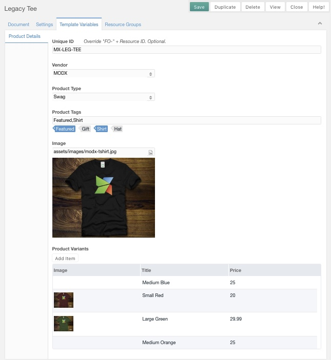

# MODX Flat Order

> A MODX extra to add a Resources Based "Shopping Cart" Table and/or Product Grid to your site.



## Features:
1. Keeps products in Local Storage not session.
2. 2 Product Variants (Size & Color) by default.
3. Confirmation screen (resource).
4. Email Order Submission, no processing (via snippet > ajax).
5. Built using KnockoutJS so adding Filtering is easily done.

## Dependencies:
1. jQuery (CDN called in Template)
2. Knockout JS (CDN called in Template)
3. MIGX - You must have at least 1 Product Variant in the MIGX table for every product. But the Option Dropdowns are not required.

## Default Settings:
1. Template Variable "Option 1" - Will be a "Size" option.
2. Template Variable "Option 2" - Will be a "Color" option.
3. Template Variables "Product Tag", "Product Type", and "Vendor" are not used in the Published Free Version. You can use them inside grid loops or product pages like you would any other Template Variable.

____

## After Install, System Setup:

1. Update the Template Variable "fo_variants" to be a **MIGX** input type. Below are the JSON configuration settings.

   **Form Tabs:**
   ```
   [{"fields": [
    {"field": "title","caption": "Title"},
    {"field": "price","caption": "Price"},
    {"field": "featured_image","caption": "Image","inputTVtype": "image"},
    {"field": "option1","caption": "Option One","inputTV":"fo_option1"},
    {"field": "option2","caption": "Option Two","inputTV":"fo_option2"}
   ]}]
   ```

   **Grid Columns:**
   ```
   [
    {"header": "Image","dataIndex": "featured_image","renderer": "this.renderImage"},
    {"header": "Title","dataIndex": "title"},
    {"header": "Price","dataIndex": "price"}
   ]
   ```
2. Create a "Catalog" Resource to be the parent of your products. You could have multiple levels, like "Catalog" > "Mens" > "Shirts" if you want.
3. In the Flat Order System Settings: Adjust "Catalog > Catalog ID" to what you just created.
4. In the Flat Order System Settings: Adjust "From Name", "Subject", and "TO" Email Address.
5. Create or Update a Template to use as a "Product Template" and assign the Template Variables for Flat Order.
6. Create Products...
